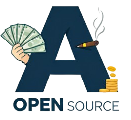
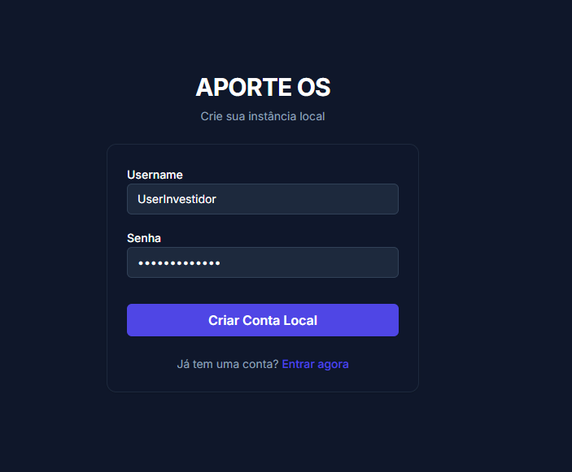
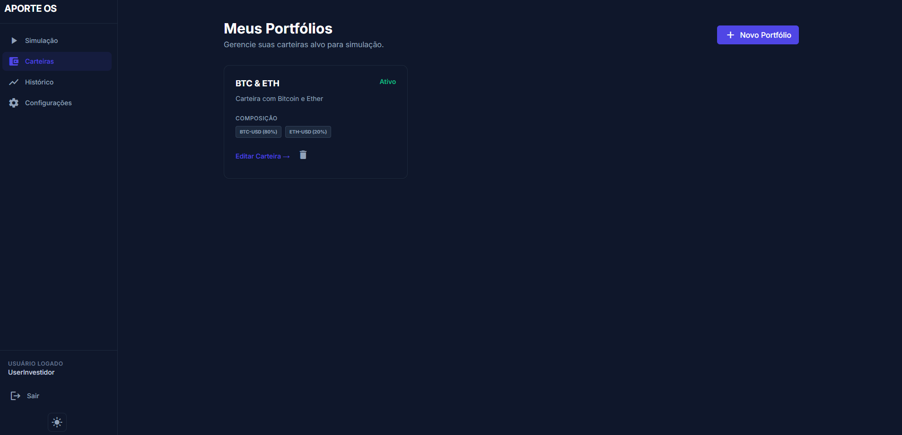
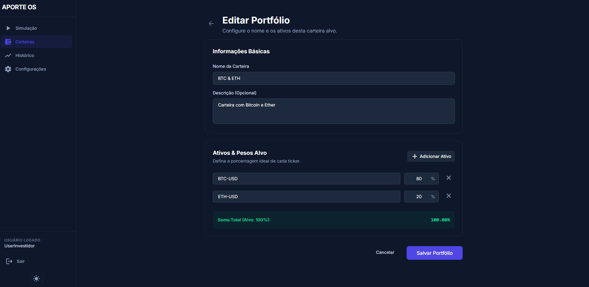
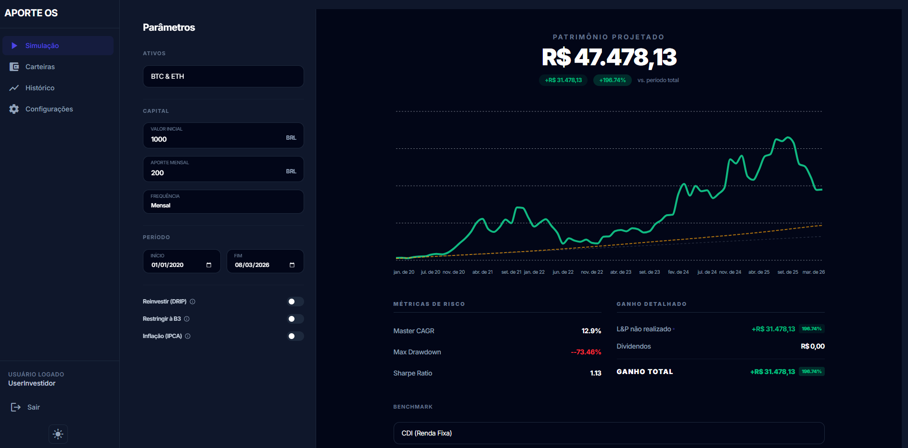
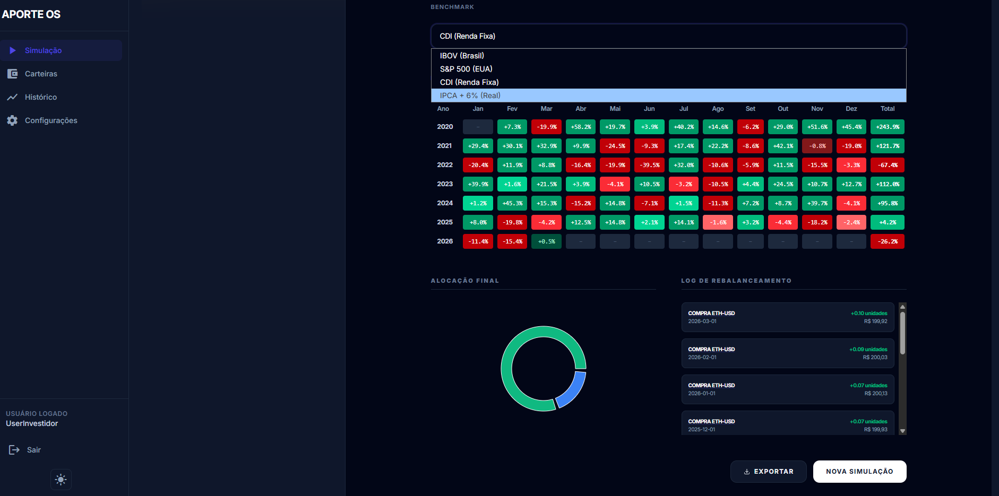
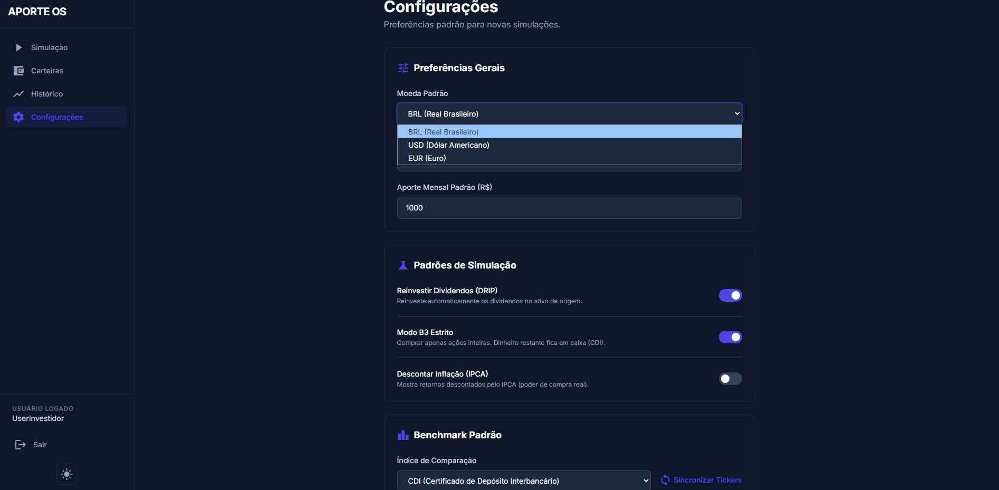
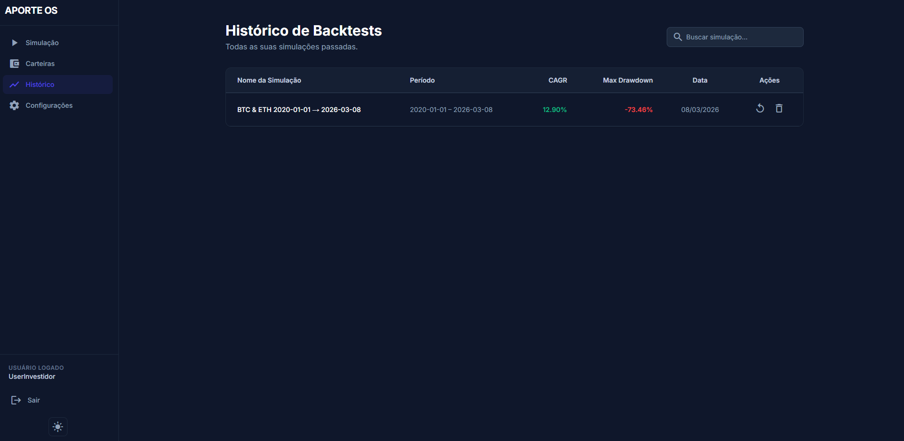

<div align="center">
  
  <h1>Aporte OSS</h1>
  <p><strong>Uma plataforma robusta, código aberto e self-hosted para rebalanceamento e backtesting de carteiras.</strong></p>
  <p>
    <a ></a>
  </p>
</div>

## O Backtester Definitivo

O Aporte foi construído para resolver uma dor peculiar do pequeno investidor: **simular a realidade de aportes mensais com rebalanceamento ativo**. 
Ao contrário da maioria dos backtesters que mostram apenas retornos de aportes únicos ("lump sum"), o Aporte calcula dinamicamente exatamente o que acontece quando você investe dinheiro novo todo mês para comprar o *ativo que está para trás* na sua carteira (também conhecido como Rebalanceamento por Aportes).

Construído inteiramente no espírito **Self-Hosted** (hospede você mesmo), o Aporte garante 100% de privacidade dos dados. Sem SaaS, sem sincronização em nuvem, sem rastreamento externo. Seus dados financeiros vivem inteiramente na sua própria máquina.

## Funcionalidades

- **Backtesting Flexível**: Simula aportes **mensais, quinzenais ou semanais** com cálculo de ganho real.
- **Motor de Rebalanceamento Inteligente**: O algoritmo central detecta automaticamente déficits no peso e compra os ativos abaixo da meta durante os aportes.
- **Benchmarks Avançados**: Compare sua carteira contra **IBOV, S&P 500, CDI (Selic)** ou **IPCA + 6%** (Retorno Real).
- **Suporte a Múltiplos Ativos**: Extrai dados históricos gratuitos via Yahoo Finance para Ações da B3 (Brasil), Ações dos EUA, BDRs, Criptomoedas e ETFs.
- **Reinvestimento de Dividendos (DRIP)**: Escolha se deseja reinvestir dividendos automaticamente ou mantê-los em caixa.
- **Otimização e Proteção (Redis Cache)**: Camada de cache nativa que evita *rate limiting* e acelera simulações para < 50ms.
  - **Eficiência**: O sistema utiliza um padrão *Cache-Aside* com o Redis para armazenar dados de séries históricas. Isso evita chamadas repetitivas às APIs do Yahoo Finance e do Banco Central (SGS), protegendo contra bloqueios de IP e garantindo performance instantânea após a primeira consulta.
  - **TTLs**: Séries históricas (24h), Dividendos (24h), Cotações Real-time (5 min) e Dados Macro/BCB (1 semana).
- **Privacidade em Primeiro Lugar**: Banco de dados SQLite local e credenciais auto-hospedadas NextAuth. Você é o único administrador.

---

## Conceitos Técnicos & Glossário

Para aproveitar ao máximo o Aporte OSS, é importante entender os pilares financeiros que regem o motor de simulação:

###  Rebalanceamento por Aportes
Esta é a funcionalidade central do projeto. Ao contrário do rebalanceamento tradicional (que exige vender ativos que subiram para comprar os que caíram), o **Rebalanceamento por Aportes** utiliza apenas o capital novo (seu aporte mensal) para comprar os ativos que estão com o maior déficit em relação à meta. Isso elimina o pagamento de impostos sobre vendas e reduz custos de corretagem.

###  Métricas de Desempenho
- **Master CAGR (Compound Annual Growth Rate)**: A Taxa de Crescimento Anual Composta. Representa o retorno anual médio que sua carteira entregou no período simulado, considerando o efeito dos juros compostos.
- **Max Drawdown**: Representa a queda máxima (do pico ao fundo) que sua carteira sofreu. É a métrica mais pura de risco psicológico: "quanto eu aguentaria ver meu patrimônio cair sem pânico?".
- **Sharpe Ratio**: Uma medida que avalia o retorno excedente da carteira em relação à sua volatilidade. Quanto maior o Sharpe, mais eficiente foi o retorno em relação ao risco corrido.

### Glossário de Termos
- **DRIP (Dividend Reinvestment Plan)**: Estratégia de pegar cada centavo recebido em dividendos e juros sobre capital próprio (JCP) e reinvesti-los imediatamente para acelerar o efeito "bola de neve".
- **Índice de Referência / Custo de Oportunidade**: Indicador usado para comparar a performance da sua carteira (ex: "Minha carteira rendeu mais que o CDI ou o Ibovespa?"). No gráfico, é representado pela **linha laranja**.
- **B3 Strict Mode**: Um modo de simulação que restringe compras apenas a lotes inteiros (múltiplos de 1 ou 100 conforme a regra da B3), simulando com precisão a impossibilidade de comprar frações decimais em certos cenários.
- **IPCA (Inflação)**: O Índice de Preços ao Consumidor Amplo. Quando ativado, o sistema desconta essa taxa do valor final para mostrar o seu **Ganho Real** (poder de compra).

---

## Tour Visual

O Aporte OSS oferece uma interface técnica e limpa, desenhada para clareza visual e precisão nos dados. Abaixo, detalhamos os principais módulos do sistema:

### 1. Autenticação Privada
O sistema é **self-hosted**. Ao iniciar, você cria uma conta local que vive apenas no seu banco de dados. Seus dados financeiros nunca saem da sua máquina.



### 2. Gestão de Portfólios
Crie e edite suas carteiras alvo definindo pesos percentuais para cada ativo. O sistema suporta Ações, FIIs, Criptos e Stocks americanas.

<div align="center">
  
  
</div>

*À esquerda: Visão geral das carteiras salvas. À direita: Editor de pesos e ativos.*

### 3. Motor de Simulação (Backtesting)
O coração do projeto. Ajuste parâmetros de aporte, frequência e período para ver a projeção do seu patrimônio.



*Gráfico interativo comparando Patrimônio (linha verde), Capital Investido (linha cinza) e o Índice de Referência/Custo de Oportunidade (linha laranja).*

### 4. Inteligência e Métricas
Analise o desempenho através de mapas de calor mensais e acompanhe exatamente onde o algoritmo de rebalanceamento realizou as compras.



*Dropdown de benchmarks e Heatmap color-coded para identificar meses de alta e baixa volatilidade.*

### 5. Configurações e Histórico
Personalize sua experiência definindo moedas padrão, benchmarks e regras de aporte (DRIP, B3 Mode). Todas as suas simulações ficam salvas para consulta rápida.

<div align="center">
  
  
</div>

---
## Ativos Suportados

O sistema conta com um banco de dados pré-alimentado para facilitar a busca (auto-complete). Atualmente, suportamos mais de 140 ativos:

<details>
<summary><b>📂 Clique para expandir: Ações B3 (IBOV + IBRX + Small Caps)</b></summary>

| Ticker | Nome | Ticker | Nome |
|:---:|:---|:---:|:---|
| RRRP3 | 3R Petroleum | ALPA4 | Alpargatas |
| ABEV3 | Ambev | AMER3 | Americanas |
| ARZZ3 | Arezzo | ASAI3 | Assaí |
| AZUL4 | Azul | B3SA3 | B3 |
| BBAS3 | Banco do Brasil | BBSE3 | BB Seguridade |
| BBDC3 | Bradesco ON | BBDC4 | Bradesco PN |
| BRAP4 | Bradespar | BRFS3 | BRF |
| BPAC11 | BTG Pactual | CRFB3 | Carrefour Brasil |
| CCRO3 | CCR | CMIG4 | Cemig |
| CIEL3 | Cielo | COGN3 | Cogna |
| CPLE6 | Copel | CSAN3 | Cosan |
| CPFE3 | CPFL Energia | CVCB3 | CVC |
| CYRE3 | Cyrela | DXCO3 | Dexco |
| ELET3 | Eletrobras ON | ELET6 | Eletrobras PN |
| EMBR3 | Embraer | ENGI11 | Energisa |
| ENEV3 | Eneva | EGIE3 | Engie |
| EQTL3 | Equatorial | EZTC3 | EZTEC |
| FLRY3 | Fleury | GGBR4 | Gerdau |
| GOAU4 | Gerdau Metalúrgica | GOLL4 | Gol |
| HAPV3 | Hapvida | HYPE3 | Hypera |
| IGTI11 | Iguatemi | IRBR3 | IRB Brasil |
| ITSA4 | Itaúsa | ITUB4 | Itaú Unibanco |
| JBSS3 | JBS | KLBN11 | Klabin |
| RENT3 | Localiza | LREN3 | Lojas Renner |
| LWSA3 | Locaweb | MGLU3 | Magazine Luiza |
| MRVE3 | MRV | BEEF3 | Minerva |
| MULT3 | Multiplan | NTCO3 | Natura |
| PETR3 | Petrobras ON | PETR4 | Petrobras PN |
| PRIO3 | PetroRio | PETZ3 | Petz |
| RADL3 | RaiaDrogasil | RAIZ4 | Raízen |
| RDOR3 | Rede D'Or | RAIL3 | Rumo |
| SBSP3 | Sabesp | SANB11 | Santander |
| SMTO3 | São Martinho | CSNA3 | Siderúrgica Nacional |
| SLCE3 | SLC Agrícola | SUZB3 | Suzano |
| TAEE11 | Taesa | VIVT3 | Telefônica Brasil |
| TIMS3 | TIM | TOTS3 | Totvs |
| UGPA3 | Ultrapar | USIM5 | Usiminas |
| VALE3 | Vale | VAMO3 | Grupo Vamos |
| VBBR3 | Vibra Energia | WEGE3 | WEG |
| YDUQ3 | Yduqs | | |

</details>

<details>
<summary><b>📂 Clique para expandir: Fundos Imobiliários (FIIs)</b></summary>

| Ticker | Nome | Ticker | Nome |
|:---:|:---|:---:|:---|
| MXRF11 | Maxi Renda | HGLG11 | CGHG Logística |
| KNRI11 | Kinea Renda | XPLG11 | XP Log |
| XPIN11 | XP Industrial | VISC11 | Vinci Shopping |
| HGRE11 | HG Real Estate | HGBS11 | Hedge Brasil Shopping |
| BTLG11 | BTG Pactual Log | RECR11 | Recv Recebíveis |
| CPTS11 | Capitânia Securities | IRDM11 | Iridium Recebíveis |
| KNCR11 | Kinea Rendimentos | ALZR11 | Alianza Trust Renda |
| BCFF11 | BTG Fundo de Fundos | HSML11 | HSI Malls |
| MALL11 | Malls Brasil Plural | TRXF11 | TRX Real Estate |
| LVBI11 | VBI Logística | VILG11 | Vinci Logística |

</details>

<details>
<summary><b>📂 Clique para expandir: Criptomoedas</b></summary>

| Ticker | Nome | Ticker | Nome |
|:---:|:---|:---:|:---|
| BTC | Bitcoin | ETH | Ethereum |
| SOL | Solana | XRP | XRP |
| BNB | BNB | ADA | Cardano |
| DOGE | Dogecoin | DOT | Polkadot |
| MATIC | Polygon | LINK | Chainlink |
| DAI | Dai | LTC | Litecoin |
| BCH | Bitcoin Cash | SHIB | Shiba Inu |
| UNI | Uniswap | AVAX | Avalanche |
| XLM | Stellar | ATOM | Cosmos |
| NEAR | NEAR Protocol | LDO | Lido DAO |
| VET | VeChain | INJ | Injective |
| RNDR | Render | FET | Fetch.ai |
| PEPE | Pepe | | |

</details>

<details>
<summary><b>📂 Clique para expandir: ETFs & Índices</b></summary>

| Ticker | Nome |
|:---:|:---|
| BOVA11 | iShares Ibovespa |
| SMAL11 | iShares Small Cap |
| IVVB11 | iShares S&P 500 |
| HASH11 | Hashdex Nasdaq Crypto |
| QBTC11 | QR Bitcoin ETF |
| QETH11 | QR Ethereum ETF |
| USTBRL=X | Dólar / Real |
| ^BVSP | Ibovespa |
| ^GSPC | S&P 500 |

</details>

## Como Executar (Configuração Zero)

Foi empacotado o Motor Matemático em Python (FastAPI) e o Frontend em Next.js juntos via Docker. Você só precisa de um comando para rodar tudo com segurança.

### Pré-requisitos
- [Docker](https://docs.docker.com/get-docker/) instalado e rodando.

### Instalação em 1 Clique

Clone este repositório e execute o script de inicialização na raiz:

**Linux / macOS:**
```bash
./start.sh
```

**Windows (PowerShell):**
```powershell
.\start.ps1
```

*O script gerará automaticamente suas credenciais seguras no arquivo `.env`, construirá as imagens Docker e iniciará o ambiente local.*

> **Parar a Aplicação**: Para parar os containers de forma limpa e liberar memória, execute `./stop.sh` ou `.\stop.ps1`.

> **Resetar o Ambiente**: Se quiser limpar o cache matemático (Redis) e forçar a reconstrução da infraestrutura sem perder seu banco de dados, utilize `./reset.sh` ou `.\reset.ps1`.

### Acesso
Abra seu navegador e acesse:
[http://localhost:3000](http://localhost:3000)

1. Crie uma conta local na página de "Cadastro".
2. Faça login e comece a simular!

### Variáveis de Ambiente (.env)

O sistema utiliza as seguintes variáveis para configuração. Caso use o `start.sh`, elas são geradas automaticamente.

| Variável | Descrição | Valor Padrão |
|:--- |:--- |:--- |
| `AUTH_SECRET` | Chave de criptografia para sessões (NextAuth) | *Gerada no setup* |
| `NEXT_PUBLIC_API_URL` | URL de comunicação com o Motor Matemático | `http://math-engine:8000` |
| `DATABASE_URL` | String de conexão com o Banco de Dados | `file:./dev.db` |
| `REDIS_HOST` | Endereço do servidor Redis para cache | `redis` |

---

## Arquitetura

O Aporte utiliza uma abordagem moderna de monorepo full-stack gerenciada pelo Turborepo:

- **Frontend (`apps/web`)**: Next.js 15 (App Router), Tailwind CSS v4, Recharts.
- **Biblioteca de Componentes (`packages/ui`)**: Sistema de design compartilhado.
- **Banco de Dados**: SQLite local via Prisma ORM.
- **Motor Matemático (`services/math-engine`)**: Python 3.11, FastAPI, Pandas, yfinance.
- **Cache**: Redis.

---

## Troubleshooting

### Docker falhou em iniciar?
Certifique-se de que as portas `3000` (Web), `8000` (Math) e `6379` (Redis) estão livres. Tente `docker compose down -v` para limpar volumes orfãos.

### Erro de "Rate Limit" no Yahoo Finance?
O Aporte possui cache em camadas. Se você tentar simular 50 ativos diferentes em 1 minuto, o Yahoo pode bloquear seu IP temporariamente. Aguarde 15 minutos ou use um VPN.

### Como resetar o Banco de Dados?
Exclua o arquivo `apps/web/prisma/dev.db` e rode o setup novamente.

## Licença

Este projeto está licenciado sob a **AGPL-3.0**. 
